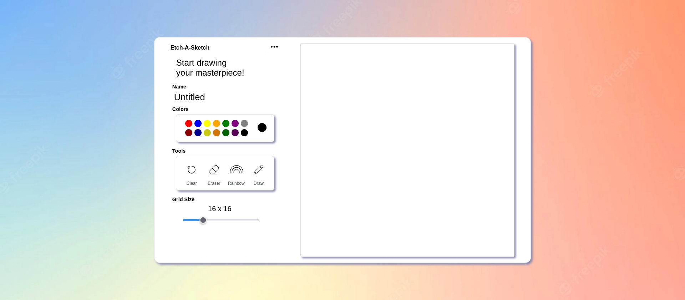
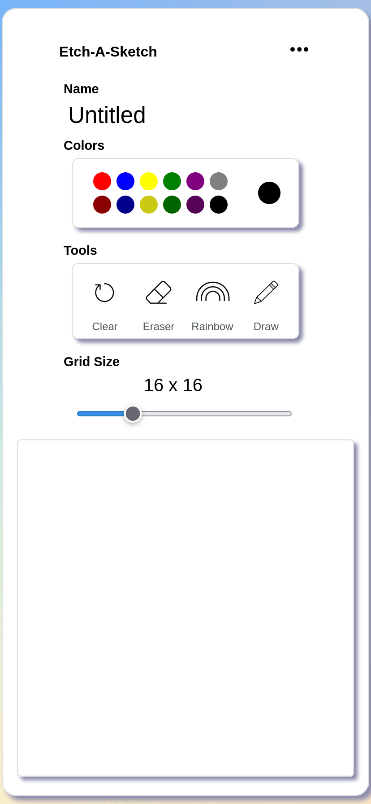

# Etch-A-Sketch (WIP)

# Demo
https://ken862734801.github.io/Etch-A-Sketch/

# Preview

View on mobile.

# Summary

The goal of this Odin Project assignment was to use utilize javascript and DOM manipulation to produce the browser equivalent of an etch-a-sketch. 
[Link to the assignment](https://www.theodinproject.com/lessons/foundations-etch-a-sketch)

I plan to revist the project and fix some bugs regarding the creation of a new grid, as well, as attempt to make it more clear which mode the program is in but for now I am happy with the result.

## Features
-Basic touch screen functionality. Gives user ability to draw on mobile devices.
-Color input gives user access to color palette.
-Rainbow function produces a randomly generated color for each "pixel" drawn over.
-Range input gives user ability to change "pixel" size. 

# Resources

Stackoverflow and google were my best friends for this project. Initially I wasn't planning on implementing mobile utility; however, coming across one of the past solutions to the assignment, which I will link below, inspired me. I was familiar with the basic events that can be listened for with javascript, but had never tought about touch events, and in the case of this assignment, the touchmove event. 

https://github.com/sebastianCastro/etch-a-sketch

## This UI served as the template.

https://dribbble.com/shots/14516980-Web-Application-PSCD
